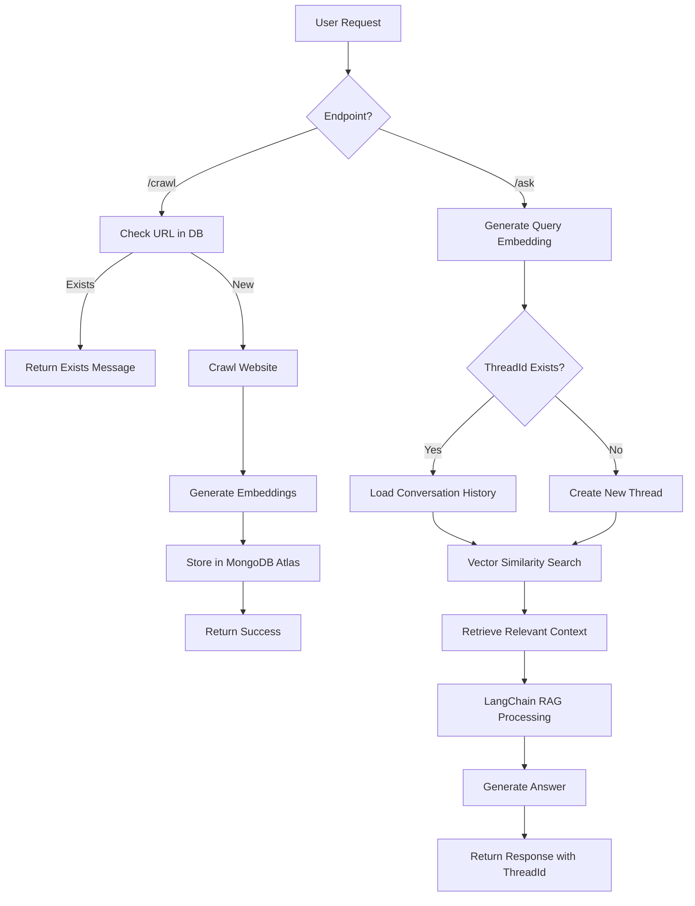

<div align="center">

# 🤖 Q&A Support Bot

### *Intelligent Question & Answer System powered by RAG*

[](https://choosealicense.com/licenses/mit/)
[](https://developer.mozilla.org/en-US/docs/Web/JavaScript)
[](https://nodejs.org/)
[](https://expressjs.com/)
[](https://www.langchain.com/)

*A sophisticated Q&A support bot utilizing Retrieval Augmented Generation (RAG), embeddings, and vector databases to provide intelligent answers from crawled website content.*

[Features](#-features) • [Installation](#-installation) • [Usage](#-usage) • [API Reference](#-api-reference) • [Contributing](#-contributing)

</div>

---

## 📋 Table of Contents

- [Overview](#-overview)
- [Features](#-features)
- [Tech Stack](#-tech-stack)
- [Installation](#-installation)
- [Configuration](#-configuration)
- [Usage](#-usage)
- [API Reference](#-api-reference)
- [Project Structure](#-project-structure)
- [How It Works](#-how-it-works)
- [Contributing](#-contributing)
- [License](#-license)
- [Author](#-author)

---

## 🌟 Overview

The **Q&A Support Bot** is an advanced AI-powered system that crawls website content, processes it using natural language processing techniques, generates embeddings, and stores them in a vector database. This enables intelligent retrieval of relevant information to answer user queries with high accuracy using Retrieval Augmented Generation (RAG). The bot supports conversational context through thread-based interactions. 

---

## ✨ Features

- 🕷️ **Web Crawling**:  Automatically crawls and extracts content from websites
- 🧹 **Text Cleaning**: Processes and cleans extracted text for optimal embedding generation
- 🔢 **Embeddings Generation**: Creates semantic embeddings using OpenAI models
- 💾 **Vector Database**:  Stores embeddings in MongoDB Atlas for efficient similarity search
- 🤖 **RAG System**:  Implements Retrieval Augmented Generation for accurate responses
- 💬 **Conversational Context**: Thread-based conversations for contextual follow-up questions
- 🔄 **Duplicate Detection**: Smart detection of already crawled URLs
- 🚀 **Express API**: RESTful API for easy integration
- 🛡️ **Security**:  Enhanced security with Helmet middleware
- 📊 **Request Logging**: Detailed logging with Morgan
- 🔄 **CORS Enabled**: Cross-origin resource sharing support
- 🗄️ **MongoDB Integration**: Persistent data storage

---

## 🛠️ Tech Stack

**Backend:**
- Node.js
- Express.js v5.1.0
- JavaScript (ES Modules)

**AI/ML:**
- LangChain v1.1.1
- @langchain/openai v1.1.3
- @langchain/core v1.1.0
- @langchain/textsplitters v1.0.1

**Database:**
- ChromaDB v3.1.6 (Vector Database)
- MongoDB v7.0.0
- Mongoose v9.0.0

**Utilities:**
- Axios v1.13.2 (HTTP client)
- Cheerio v1.1.2 (Web scraping)
- Zod v4.1.13 (Schema validation)
- Helmet v8.1.0 (Security)
- Morgan v1.10.1 (Logging)
- CORS v2.8.5

**Development:**
- Nodemon v3.1.11
- Dotenv v17.2.3

---

## 📦 Installation

### Prerequisites

- Node.js (v14 or higher)
- npm or yarn
- MongoDB Atlas instance
- OpenAI API key

### Steps

1. **Clone the repository**
   ```bash
   git clone https://github.com/KIRAN-MISKIN/Q-A_Support_Bot. git
   cd Q-A_Support_Bot
   ```

2. **Install dependencies**
   ```bash
   npm install
   ```

3. **Set up environment variables**
   
   Create a `.env` file in the root directory:
   ```env
   OPENAI_API_KEY=your_openai_api_key_here
   MONGODB_URI=your_mongodb_connection_string
   PORT=8000
   ```

4. **Start the server**
   
   **Production mode:**
   ```bash
   npm start
   ```
   
   **Development mode (with auto-reload):**
   ```bash
   npm run dev
   ```

---

## ⚙️ Configuration

Configure the following environment variables in your `.env` file:

| Variable | Description | Required |
|----------|-------------|----------|
| `OPENAI_API_KEY` | Your OpenAI API key for embeddings and completions | ✅ Yes |
| `MONGODB_URI` | MongoDB Atlas connection string | ✅ Yes |
| `PORT` | Server port (default: 8000) | ❌ No |

---

## 🚀 Usage

### Starting the Bot

```bash
# Production
npm start

# Development with hot reload
npm run dev
```

The server will start on `http://localhost:8000` (or your configured PORT).

### Quick Start Example

1. **Crawl a website:**
   ```bash
   curl --location 'http://localhost:8000/api/crawl' \
   --header 'Content-Type: application/json' \
   --data '{"baseUrl": "https://www.airtribe.live"}'
   ```

2. **Ask a question:**
   ```bash
   curl --location 'http://localhost:8000/api/ask' \
   --header 'Content-Type: application/json' \
   --data '{"query": "What is Airtribe?"}'
   ```

---

## 📚 API Reference

### Base URL
```
http://localhost:8000/api
```

---

### Endpoints

#### Crawl Website

```http
POST /api/crawl
```

Crawls a website, extracts content, generates embeddings, and stores them in the vector database.

| Parameter | Type     | Description                |
| :-------- | :------- | :------------------------- |
| `baseUrl` | `string` | **Required**. The website URL to crawl |

**Request Example:**
```bash
curl --location 'http://localhost:8000/api/crawl' \
--header 'Content-Type: application/json' \
--data '{
    "baseUrl": "https://www.airtribe.live"
}'
```

**Response Example (URL Already Exists):**
```json
{
    "status": "success",
    "data": {
        "status": "exists",
        "message": "URL already crawled and exists in DB."
    }
}
```

**Response Example (New URL Crawled Successfully):**
```json
{
    "status": "success",
    "data": {
        "status": "success",
        "message": "Url data stored successfully in DB"
    }
}
```

**Status Codes:**
- `200`: Success (URL exists or crawled successfully)
- `400`: Bad Request (Missing baseUrl)
- `500`: Internal Server Error

---

#### Ask Question

```http
POST /api/ask
```

Ask a question to the bot and receive an AI-generated answer based on crawled content.  Supports conversational context through thread IDs.

| Parameter | Type     | Description                |
| :-------- | :------- | :------------------------- |
| `query`   | `string` | **Required**. Question to ask the bot |
| `threadId`| `string` | **Optional**. Thread ID for continuing a conversation |

**Request Example (New Conversation):**
```bash
curl --location 'http://localhost:8000/api/ask' \
--header 'Content-Type: application/json' \
--data '{
    "query": "Does this help me in solving the customer experience"
}'
```

**Request Example (Continue Existing Conversation):**
```bash
curl --location 'http://localhost:8000/api/ask' \
--header 'Content-Type: application/json' \
--data '{
    "query":  "Does this help me in solving the customer experience",
    "threadId": "352148b63f1eefb2fa855f1fa564b17d"
}'
```

**Response Example:**
```json
{
    "status": "success",
    "data": {
        "threadId":  "352148b63f1eefb2fa855f1fa564b17d",
        "response": "I don't have enough information."
    }
}
```

**Response Example (With Context):**
```json
{
    "status": "success",
    "data": {
        "threadId": "352148b63f1eefb2fa855f1fa564b17d",
        "response": "Based on the information from Airtribe, yes, this platform helps improve customer experience by providing upskilling programs that enable professionals to better understand and serve customer needs..."
    }
}
```

**Status Codes:**
- `200`: Success
- `400`: Bad Request (Missing query parameter)
- `500`: Internal Server Error

---

### Helper Functions

#### crawlWebsite(baseUrl)

Crawls a website and extracts all relevant content.

**Parameters:**
- `baseUrl` (string): Base URL of the website to crawl

**Returns:** Promise<Object> - Crawled pages data

---

#### generateEmbedding(text)

Takes text and generates vector embeddings using OpenAI.  

**Parameters:**
- `text` (string): Text to embed

**Returns:** Promise<Array> - Vector embedding array

---

#### processQuery(query, threadId)

Processes user query and generates response using RAG.

**Parameters:**
- `query` (string): User's question
- `threadId` (string|null): Optional thread ID for conversation context

**Returns:** Promise<Object> - Response with threadId and answer

---

## 📁 Project Structure

```
Q-A_Support_Bot/
├── src/
│   ├── controllers/      # Request handlers
│   ├── models/          # Database models
│   ├── routes/          # API routes
│   ├── services/        # Business logic
│   ├── utils/           # Helper functions
│   └── config/          # Configuration files
├── index.js             # Application entry point
├── server.js            # Server configuration
├── package.json         # Project dependencies
├── .gitignore          # Git ignore rules
├── LICENSE             # MIT License
└── README.md           # Project documentation
```

---

## 🔍 How It Works

### 1. Web Crawling Process
- User provides a `baseUrl` to the `/api/crawl` endpoint
- System checks if the URL has already been crawled
- If new, the bot crawls the website using Axios and Cheerio
- Content is extracted and cleaned from all accessible pages

### 2. Embedding Generation
- Extracted content is split into manageable chunks using LangChain text splitters
- Each chunk is converted into vector embeddings using OpenAI's embedding models
- Embeddings are stored in MongoDB Atlas vector database with metadata

### 3. Question Answering (RAG)
- User sends a question via `/api/ask` endpoint
- The query is converted to an embedding
- Vector similarity search retrieves the most relevant document chunks
- Retrieved context is fed to LangChain with the user's question
- AI generates an accurate, context-aware answer
- Response includes a `threadId` for conversation continuity

### 4. Conversational Context
- If `threadId` is provided in subsequent requests, the bot maintains conversation history
- This allows for follow-up questions and contextual dialogue
- Each conversation thread is tracked independently



---

## 🤝 Contributing

Contributions are always welcome! Here's how you can help:

1. Fork the repository
2. Create your feature branch (`git checkout -b feature/AmazingFeature`)
3. Commit your changes (`git commit -m 'Add some AmazingFeature'`)
4. Push to the branch (`git push origin feature/AmazingFeature`)
5. Open a Pull Request

### Contribution Guidelines

- Write clear, commented code
- Follow existing code style
- Add tests for new features
- Update documentation as needed
- Ensure all API endpoints work as expected

---

## 📄 License

This project is licensed under the **MIT License** - see the [LICENSE](LICENSE) file for details.

```
MIT License

Copyright (c) 2025 Kirankumar Miskin

Permission is hereby granted, free of charge, to any person obtaining a copy
of this software and associated documentation files...  
```

---

## 👨‍💻 Author

**Kirankumar Miskin**

- GitHub: [@KIRAN-MISKIN](https://github.com/KIRAN-MISKIN)
- Repository: [Q-A_Support_Bot](https://github.com/KIRAN-MISKIN/Q-A_Support_Bot)

---

## 🙏 Acknowledgments

- [LangChain](https://www.langchain.com/) for the powerful RAG framework
- [OpenAI](https://openai.com/) for embeddings and language models
- [MongoDB Atlas](https://www.mongodb.com/atlas) for vector database capabilities
- [ChromaDB](https://www.trychroma.com/) for local vector storage
- All contributors and supporters of this project

---

## 📞 Support

If you have any questions or need help, please: 

- Open an [issue](https://github.com/KIRAN-MISKIN/Q-A_Support_Bot/issues)
- Contact via GitHub

---

## 🔧 Troubleshooting

### Common Issues

**Issue:  "URL already crawled and exists in DB"**
- This is expected behavior when trying to crawl a URL that's already in the database
- The system prevents duplicate crawling to save resources

**Issue: "I don't have enough information"**
- Make sure you've crawled the relevant website first using `/api/crawl`
- Check that your question is related to the crawled content
- Try rephrasing your question

**Issue: Connection errors**
- Verify your MongoDB Atlas connection string is correct
- Check that your OpenAI API key is valid and has sufficient credits
- Ensure the server is running on the correct port

---

<div align="center">

### ⭐ Star this repository if you find it helpful!

Made with ❤️ by [Kirankumar Miskin](https://github.com/KIRAN-MISKIN)

</div>
